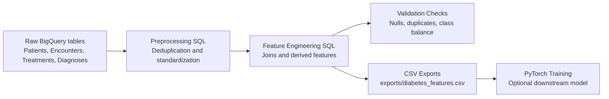

# Predicting Hospital Readmission for Diabetic Patients

This project is primarily a data engineering pipeline for transforming raw hospital tables into a clean, validated, modeling-ready dataset in BigQuery. The repository also includes a lightweight PyTorch model that consumes the engineered features, but the core value is the ETL and feature engineering workflow.

## Data Engineering Overview

The workflow in this repository follows four stages:

1. Raw hospital tables are deduplicated and standardized in BigQuery.
2. Patient, encounter, treatment, and diagnosis records are joined into an encounter-level analytic table.
3. Data quality checks verify nulls, duplicates, and baseline class balance.
4. Engineered features are exported to CSV for downstream analysis and modeling.

## Architecture

The project architecture is a simple batch pipeline that starts with raw source tables in BigQuery, transforms them into a validated feature table, and then exports that dataset for downstream consumption.



This layout keeps the data engineering layer separate from the modeling layer, so the feature dataset can be reused independently of the classifier.

## Repository Structure

- `code/SQL_scripts copy/preprocessing.sql` - deduplicates and cleans the source BigQuery tables.
- `code/SQL_scripts copy/feature_engineering.sql` - creates the final feature table used for analysis and modeling.
- `code/SQL_scripts copy/analysis_checks.sql` - runs validation checks and baseline sanity checks.
- `code/task.py` - trains the optional PyTorch model and saves evaluation artifacts.
- `exports/` - raw, cleaned, and feature-engineered CSV exports.
- `model/` - saved model parameters, preprocessing pipeline, metrics, and confusion matrix.
- `vertex_ai_logs/` - logs from the Vertex AI training job.

## ETL Pipeline

The raw source tables are `Patients`, `Encounters`, `Treatments`, and `Diagnoses`. The preprocessing SQL removes duplicate records, standardizes null or blank values, and joins the tables into a clean encounter-level dataset. Diagnosis codes are then reshaped into a wide format before the final modeling table is created.

The feature engineering step creates the following signals:

- `utilization_total` from outpatient, emergency, and inpatient counts.
- `meds_per_day` and `procedures_per_day` based on hospital stay length.
- Binary indicators for diabetes medication, insulin use, medication change, and high inpatient history.
- `age_mid` as a numeric midpoint for the age bucket.
- Diagnosis code group prefixes for the first three diagnosis fields.

## Data Quality Checks

`analysis_checks.sql` documents the validation logic used to confirm the pipeline output is suitable for analysis:

- row counts and null checks on the final feature table,
- duplicate checks on the modeling dataset,
- class balance inspection for the target label,
- a simple baseline rule for comparison against the ML model.

## Modeling Approach

`code/task.py` trains a small feed-forward neural network with two hidden layers (128 and 64 units) using PyTorch. This is included as a downstream consumer of the engineered dataset rather than the main project focus. The script:

- drops identifier columns such as `encounter_id` and `patient_nbr` before training,
- imputes missing values,
- scales numeric features,
- one-hot encodes categorical features,
- splits the data into train and test sets with stratification,
- trains with Adam and binary cross-entropy with logits,
- evaluates precision, recall, F1, specificity, balanced accuracy, ROC AUC, and PR AUC.

## Results

Saved metrics from the current run are:

| Metric | Value |
| --- | ---: |
| Precision | 0.9744 |
| Recall | 0.9883 |
| F1 score | 0.9813 |
| Specificity | 0.9130 |
| Balanced accuracy | 0.9507 |
| ROC AUC | 0.9973 |
| PR AUC | 0.9992 |

The trained artifacts currently stored in `model/` are:

- `model_parameters.pt`
- `preprocessor.joblib`
- `confusion_matrix.csv`
- `metrics.json`

## How To Reproduce

1. Run the BigQuery preprocessing and feature engineering scripts in this order:

   - `code/SQL_scripts copy/preprocessing.sql`
   - `code/SQL_scripts copy/feature_engineering.sql`
   - `code/SQL_scripts copy/analysis_checks.sql`

2. Install the Python dependencies used by the training script:

	```bash
	pip install pandas numpy torch scikit-learn joblib google-cloud-storage
	```

3. Run training against the engineered feature set if you want to reproduce the ML benchmark:

	```bash
	python code/task.py --data_path exports/diabetes_features.csv --target_col target --model_dir model
	```

4. Review the outputs in `exports/` and `model/` after the run completes.

If you are running the script in Vertex AI, the model artifacts are also uploaded to the configured `AIP_MODEL_DIR` location when it points to a Google Cloud Storage path.

## Notes

- The workspace includes intermediate CSV exports for each major pipeline stage, which makes it easy to inspect the data at every step.
- The SQL scripts are written for BigQuery.
